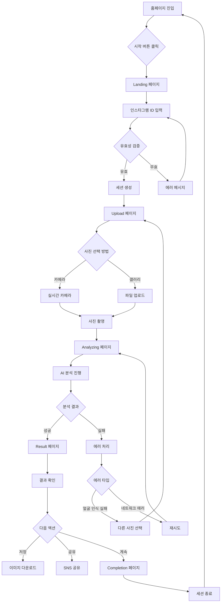

# PCA-HIJAB 서비스 구현 현황 상세 보고서

## 목차
1. [서비스 개요](#1-서비스-개요)
2. [전체 사이트맵 및 User Flow](#2-전체-사이트맵-및-user-flow)
3. [페이지별 상세 스펙](#3-페이지별-상세-스펙)
4. [UI 컴포넌트 라이브러리](#4-ui-컴포넌트-라이브러리)
5. [디자인 시스템](#5-디자인-시스템)
6. [인터랙션 및 애니메이션](#6-인터랙션-및-애니메이션)
7. [예외처리 및 에러 상태](#7-예외처리-및-에러-상태)
8. [모바일 및 반응형 디자인](#8-모바일-및-반응형-디자인)
9. [접근성 및 사용성](#9-접근성-및-사용성)

---

## 1. 서비스 개요

### 1.1 기본 정보
- **서비스명**: PCA-HIJAB (Personal Color Analysis for Hijab)
- **버전**: 3.0 (2025년 1월 기준)
- **배포 URL**: https://pca-hijab.vercel.app
- **플랫폼**: 웹 기반 모바일 우선 서비스
- **지원 브라우저**: Chrome, Safari, Firefox (최신 2개 버전)
- **지원 디바이스**: iOS 14+, Android 10+

### 1.2 서비스 목적
AI 기술을 활용하여 사용자의 얼굴 사진을 분석하고, 개인에게 가장 잘 어울리는 퍼스널 컬러를 진단하여 최적의 히잡 색상을 추천하는 서비스

### 1.3 타겟 사용자
- **연령**: 18-35세
- **성별**: 여성
- **특징**: 히잡 착용, 인스타그램 활발 사용
- **니즈**: 자신에게 어울리는 히잡 색상 선택의 어려움 해결

### 1.4 핵심 가치 제안 (Value Proposition)
1. **즉각적 진단**: 30초 이내 AI 퍼스널 컬러 분석
2. **정확한 분석**: 478개 얼굴 포인트 정밀 스캔
3. **개인 맞춤**: 4계절 16가지 타입 세분화
4. **프라이버시 보호**: 사진 즉시 삭제, 데이터 미보관

---

## 2. 전체 사이트맵 및 User Flow

### 2.1 사이트맵 구조

```
┌─────────────────────────────────────────────────────┐
│                    PCA-HIJAB                        │
├─────────────────────────────────────────────────────┤
│                                                      │
├── 🏠 홈 (/)                                         │
│   └── 서비스 소개 및 시작 CTA                       │
│                                                      │
├── 📱 메인 진단 플로우                               │
│   ├── Landing (/landing)                           │
│   │   └── 인스타그램 ID 입력                       │
│   ├── Upload (/diagnosis)                          │
│   │   └── 사진 촬영/업로드                         │
│   ├── Analyzing (/analyzing)                       │
│   │   └── AI 분석 진행                            │
│   ├── Result (/result)                             │
│   │   └── 퍼스널 컬러 결과                        │
│   └── Completion (/completion)                     │
│       └── 완료 및 공유                             │
│                                                      │
├── 🔐 인증 (개발용)                                  │
│   ├── Login (/login)                               │
│   ├── Signup (/signup)                             │
│   ├── Forgot Password (/forgot-password)           │
│   └── Reset Password (/reset-password)             │
│                                                      │
├── 🛍️ 상품 (개발용)                                 │
│   ├── Products (/products)                         │
│   └── Product Detail (/products/:id)               │
│                                                      │
├── 📄 콘텐츠 (개발용)                                │
│   └── Content Detail (/content/:slug)              │
│                                                      │
├── 👤 마이페이지 (개발용)                            │
│   └── My Page (/mypage)                            │
│                                                      │
├── 📋 정책                                           │
│   ├── Terms of Service (/terms-of-service)         │
│   └── Privacy Policy (/privacy-policy)             │
│                                                      │
└── 👨‍💼 관리자                                        │
    ├── Admin Login (/admin/login)                   │
    ├── Dashboard (/admin/dashboard)                 │
    └── Recommendation Detail (/admin/recommendations/:id)│
```

### 2.2 메인 User Flow



### 2.3 세션 라이프사이클

```
세션 시작 → 데이터 수집 → 분석 → 결과 저장 → 세션 종료
   ↓           ↓           ↓        ↓           ↓
Landing    Upload    Analyzing   Result    Completion
```

---

## 3. 페이지별 상세 스펙

### 3.1 홈페이지 (HomePage.tsx)

#### 3.1.1 URL 및 접근
- **경로**: `/`
- **접근 권한**: 모두
- **세션 요구**: 없음

#### 3.1.2 레이아웃 구조

**Production 환경 (실제 배포)**
```
┌──────────────────────────────────┐
│         [Header]                  │
├──────────────────────────────────┤
│                                   │
│    AI Personal Color Analysis    │
│         [메인 타이틀]             │
│                                   │
│   Find your perfect hijab colors │
│          with AI                 │
│         [서브 타이틀]             │
│                                   │
│      ┌────────────────┐          │
│      │  🎯 Start       │          │
│      │   Analysis      │          │
│      └────────────────┘          │
│         [CTA 버튼]                │
│                                   │
│  ┌──────┐ ┌──────┐ ┌──────┐     │
│  │  📸  │ │  🤖  │ │  🎨  │     │
│  │Upload│ │  AI  │ │Result│     │
│  │Photo │ │Analyze│ │      │     │
│  └──────┘ └──────┘ └──────┘     │
│      [3단계 프로세스 카드]        │
│                                   │
└──────────────────────────────────┘
```

**Development 환경**
- 콘텐츠 캐러셀 (5개 featured contents)
- 상품 그리드 (6개 products)
- 빈 상태 처리 UI

#### 3.1.3 컴포넌트 구성
- `PageLayout`: 전체 레이아웃 래퍼
- `Text`: 타이포그래피 컴포넌트
- `Button`: CTA 버튼
- `LoadingSpinner`: 로딩 상태 (개발 환경)

#### 3.1.4 상태 관리
```typescript
// 주요 상태
const [featuredContents, setFeaturedContents] = useState<Content[]>([]);
const [products, setProducts] = useState<Product[]>([]);
const [currentSlide, setCurrentSlide] = useState(0);
const [loading, setLoading] = useState(true);
```

#### 3.1.5 인터랙션
- **CTA 버튼 클릭**: `/diagnosis` 페이지로 이동
- **캐러셀 네비게이션**: 좌우 화살표, 도트 인디케이터
- **상품 카드 클릭**: 인증 체크 후 상세 페이지 이동

---

### 3.2 랜딩 페이지 (HIGLandingPage.tsx)

#### 3.2.1 URL 및 접근
- **경로**: `/landing`
- **접근 권한**: 모두
- **세션 요구**: 생성 시작점

#### 3.2.2 레이아웃 구조

```
┌──────────────────────────────────┐
│    [스크롤 프로그레스 바]          │
├──────────────────────────────────┤
│                                   │
│      [Hero Section]               │
│   퍼스널 컬러 진단 서비스         │
│                                   │
│   ┌──────────────────────┐       │
│   │  @인스타그램ID 입력   │       │
│   └──────────────────────┘       │
│   [입력 필드]                     │
│                                   │
│   ┌──────────────────────┐       │
│   │    시작하기           │       │
│   └──────────────────────┘       │
│   [제출 버튼]                     │
│                                   │
├──────────────────────────────────┤
│                                   │
│      [Features Section]           │
│   • AI 기반 정확한 분석           │
│   • 30초 빠른 진단                │
│   • 개인 맞춤 추천                │
│                                   │
├──────────────────────────────────┤
│                                   │
│      [How It Works]               │
│   1. 사진 업로드                  │
│   2. AI 분석                      │
│   3. 결과 확인                    │
│                                   │
└──────────────────────────────────┘

[플로팅 CTA - 스크롤 시 나타남]
```

#### 3.2.3 주요 기능
- **실시간 유효성 검증**: 인스타그램 ID 형식 체크
- **스크롤 추적**: Progress bar 및 플로팅 CTA
- **세션 생성**: 유효한 ID 입력 시 백엔드 세션 생성

#### 3.2.4 유효성 검증 규칙
```javascript
// 인스타그램 ID 규칙
- 최소 1자, 최대 30자
- 영문, 숫자, 밑줄(_), 마침표(.) 허용
- @ 기호 자동 제거
- 소문자 자동 변환
```

#### 3.2.5 에러 처리
- **빈 입력**: 에러 메시지 미표시
- **유효하지 않은 형식**: "Please enter a valid Instagram ID"
- **API 에러**: 토스트 알림으로 표시

---

### 3.3 업로드 페이지 (UploadPage.tsx)

#### 3.3.1 URL 및 접근
- **경로**: `/diagnosis`
- **접근 권한**: 세션 필요
- **세션 요구**: 필수 (없으면 홈으로 리다이렉트)

#### 3.3.2 레이아웃 구조

```
┌──────────────────────────────────┐
│      Upload Your Photo            │
│         [페이지 타이틀]            │
├──────────────────────────────────┤
│                                   │
│   ┌──────────────────────┐       │
│   │                      │       │
│   │    [카메라 뷰 /      │       │
│   │     업로드 이미지]    │       │
│   │                      │       │
│   │    ○ (얼굴 가이드)   │       │
│   │                      │       │
│   └──────────────────────┘       │
│                                   │
│   [실시간 카메라 또는 프리뷰]     │
│                                   │
├──────────────────────────────────┤
│                                   │
│   📷 No filters                   │
│   ☀️ Natural lighting             │
│   👤 Front facing                 │
│                                   │
│   [촬영 가이드라인]               │
│                                   │
├──────────────────────────────────┤
│                                   │
│  [🖼️]    [📸]    [🔄]            │
│ Gallery  Capture  Switch          │
│                                   │
│   [하단 컨트롤 버튼]              │
│                                   │
└──────────────────────────────────┘

[Privacy Assurance - 7초 자동 닫힘]
┌─────────────────────────┐
│ 🔒 Photos deleted       │
│    instantly            │
│ 📸→🎨→🗑️               │
└─────────────────────────┘
```

#### 3.3.3 카메라 기능 상세

**카메라 초기화 프로세스**
1. 컴포넌트 마운트 시 자동 시작
2. 권한 요청 (getUserMedia)
3. 비디오 스트림 연결
4. 프리뷰 표시

**카메라 상태**
```typescript
// 카메라 관련 상태
const [stream, setStream] = useState<MediaStream | null>(null);
const [isCameraActive, setIsCameraActive] = useState(false);
const [facingMode, setFacingMode] = useState<'user' | 'environment'>('user');
const [cameraError, setCameraError] = useState<string | null>(null);
```

**카메라 에러 처리**
- `NotAllowedError`: 권한 거부 → 업로드 대체 버튼 표시
- `NotFoundError`: 카메라 없음 → 업로드 전용 모드
- `NotReadableError`: 다른 앱 사용 중 → 에러 메시지
- `SecurityError`: HTTPS 필요 → 보안 경고

#### 3.3.4 이미지 업로드 사양
- **최대 크기**: 10MB
- **지원 형식**: JPEG, JPG, PNG, HEIC
- **압축**: 자동 압축 (compressImage 함수)
- **프리뷰**: 즉시 생성 및 표시

#### 3.3.5 프라이버시 기능
1. **PrivacyAssurance**: 하단 플로팅 알림 (7초 자동 닫힘)
2. **PrivacyPopup**: 상세 설명 모달 (수동 열기)

---

### 3.4 분석 페이지 (AnalyzingPage.tsx)

#### 3.4.1 URL 및 접근
- **경로**: `/analyzing`
- **접근 권한**: 업로드 데이터 필요
- **세션 요구**: 필수

#### 3.4.2 분석 단계별 UI

```
단계 1: Face Detection (20%)
┌──────────────────────────────────┐
│                                   │
│    [업로드 이미지]                │
│    + [랜드마크 시각화]            │
│                                   │
│    ████░░░░░░░░░░░░ 20%          │
│                                   │
│    "얼굴의 478개 포인트를         │
│     정밀 스캔 중이에요!"          │
│                                   │
└──────────────────────────────────┘

단계 2: Color Extraction (40%)
┌──────────────────────────────────┐
│                                   │
│    [색상 추출 애니메이션]         │
│                                   │
│    ████████░░░░░░░░ 40%          │
│                                   │
│    "피부톤, 홍조, 혈색을          │
│     추출하고 있어요!"             │
│                                   │
└──────────────────────────────────┘

단계 3: Warm-Cool Comparison (60%)
┌──────────────────────────────────┐
│                                   │
│    [웜/쿨 비교 시각화]            │
│                                   │
│    ████████████░░░░ 60%          │
│                                   │
│    "웜톤과 쿨톤을                 │
│     비교 중이에요!"               │
│                                   │
│    [◀] [▶] [Skip]                │
│                                   │
└──────────────────────────────────┘

단계 4: Season Comparison (80%)
┌──────────────────────────────────┐
│                                   │
│    [4계절 비교 시각화]            │
│                                   │
│    ████████████████ 80%          │
│                                   │
│    "4계절 중 가장 어울리는        │
│     시즌을 찾고 있어요!"          │
│                                   │
│    [◀] [▶] [Skip]                │
│                                   │
└──────────────────────────────────┘

단계 5: Final Result (100%)
┌──────────────────────────────────┐
│                                   │
│    [완성된 팔레트]                │
│                                   │
│    ████████████████ 100%         │
│                                   │
│    "당신만의 퍼스널 컬러          │
│     팔레트를 완성했어요!"         │
│                                   │
│    [Continue →]                   │
│                                   │
└──────────────────────────────────┘
```

#### 3.4.3 분석 프로세스
1. **이미지 전송**: FormData로 AI API 전송
2. **실시간 진행**: 단계별 애니메이션
3. **결과 수신**: JSON 응답 파싱
4. **세션 저장**: 백엔드 세션 업데이트
5. **페이지 전환**: Result 페이지로 이동

#### 3.4.4 FaceLandmarkVisualization 컴포넌트
- MediaPipe Face Mesh 시각화
- 478개 얼굴 포인트 표시
- 실시간 애니메이션 효과
- 단계 3-5에서 사용자 인터랙션 가능

---

### 3.5 결과 페이지 (ResultPage.tsx)

#### 3.5.1 URL 및 접근
- **경로**: `/result`
- **접근 권한**: 분석 결과 필요
- **세션 요구**: 필수

#### 3.5.2 레이아웃 구조

```
┌──────────────────────────────────┐
│     Your Personal Color           │
│         [페이지 타이틀]            │
├──────────────────────────────────┤
│                                   │
│   ┌──────────────────────┐       │
│   │                      │       │
│   │   [퍼스널 컬러 카드]  │       │
│   │                      │       │
│   │   Spring Warm        │       │
│   │   봄 웜톤             │       │
│   │                      │       │
│   └──────────────────────┘       │
│                                   │
├──────────────────────────────────┤
│                                   │
│   Best Colors                     │
│   ┌──┐ ┌──┐ ┌──┐ ┌──┐           │
│   │  │ │  │ │  │ │  │           │
│   └──┘ └──┘ └──┘ └──┘           │
│   ┌──┐ ┌──┐ ┌──┐ ┌──┐           │
│   │  │ │  │ │  │ │  │           │
│   └──┘ └──┘ └──┘ └──┘           │
│                                   │
│   [베스트 컬러 팔레트]            │
│                                   │
├──────────────────────────────────┤
│                                   │
│   Worst Colors                    │
│   ┌──┐ ┌──┐ ┌──┐ ┌──┐           │
│   │  │ │  │ │  │ │  │           │
│   └──┘ └──┘ └──┘ └──┘           │
│                                   │
│   [워스트 컬러 팔레트]            │
│                                   │
├──────────────────────────────────┤
│                                   │
│   [💾 Save]  [📤 Share]  [→ Next] │
│                                   │
│   [액션 버튼 그룹]                │
│                                   │
└──────────────────────────────────┘

[다운로드 힌트 툴팁 - 10초 자동 숨김]
```

#### 3.5.3 퍼스널 컬러 데이터
```typescript
// 계절별 색상 매핑
const SEASON_COLORS = {
  spring: {
    bestColors: ['#FF9999', '#FFCC99', ...],
    worstColors: ['#4B0082', '#2F4F4F', ...]
  },
  summer: {
    bestColors: ['#FFB3D9', '#D9B3FF', ...],
    worstColors: ['#FF4500', '#8B4513', ...]
  },
  autumn: {
    bestColors: ['#CC6633', '#996633', ...],
    worstColors: ['#00CED1', '#4682B4', ...]
  },
  winter: {
    bestColors: ['#FF0066', '#CC0066', ...],
    worstColors: ['#F0E68C', '#DDA0DD', ...]
  }
};
```

#### 3.5.4 결과 카드 생성
- **함수**: `generateResultCard()`
- **출력**: 1080x1350px JPEG 이미지
- **내용**: 퍼스널 컬러, 베스트 컬러, 추천 문구
- **브랜딩**: 로고, 웹사이트 URL

#### 3.5.5 공유 기능
- **Web Share API**: 네이티브 공유
- **Fallback**: 클립보드 복사
- **공유 내용**: 제목, 설명, URL

---

### 3.6 완료 페이지 (CompletionPage.tsx)

#### 3.6.1 URL 및 접근
- **경로**: `/completion`
- **접근 권한**: 분석 완료 필요
- **세션 요구**: 필수

#### 3.6.2 레이아웃 구조

```
┌──────────────────────────────────┐
│                                   │
│        ✓ (애니메이션)             │
│      [성공 체크마크]              │
│                                   │
│    Thank You!                     │
│    Your request has been          │
│    submitted successfully         │
│                                   │
│    [완료 메시지]                  │
│                                   │
├──────────────────────────────────┤
│                                   │
│   We'll send your personalized    │
│   hijab recommendations via       │
│   Instagram DM within 24 hours    │
│                                   │
│   [안내 메시지]                   │
│                                   │
├──────────────────────────────────┤
│                                   │
│   ┌──────────────────────┐       │
│   │   Save Result Card    │       │
│   └──────────────────────┘       │
│                                   │
│   ┌──────────────────────┐       │
│   │   Share with Friends  │       │
│   └──────────────────────┘       │
│                                   │
│   ┌──────────────────────┐       │
│   │   Back to Home        │       │
│   └──────────────────────┘       │
│                                   │
│   [액션 버튼 그룹]                │
│                                   │
└──────────────────────────────────┘
```

#### 3.6.3 애니메이션
- **체크마크**: Ping 애니메이션 (무한 반복)
- **페이드인**: 컨텐츠 순차 표시
- **버튼 호버**: Scale 및 Shadow 변화

#### 3.6.4 세션 종료
- "Back to Home" 클릭 시 전체 상태 초기화
- 세션 데이터 클리어
- 홈페이지로 리다이렉트

---

## 4. UI 컴포넌트 라이브러리

### 4.1 모달 및 팝업 컴포넌트

#### 4.1.1 PrivacyPopup
**용도**: 프라이버시 정책 상세 안내
**디자인**: Glassmorphism 스타일

```typescript
interface PrivacyPopupProps {
  isOpen: boolean;
  onClose: () => void;
}
```

**시각적 구조**:
```
┌─────────────────────────────────┐
│                    [X]           │
│     🔒                           │
│   Your Privacy Matters           │
│                                  │
│   Photos are analyzed instantly  │
│   and deleted immediately.       │
│                                  │
│   📸 → 🎨 → 🗑️                   │
│                                  │
│   [       Got it       ]         │
└─────────────────────────────────┘
```

**스타일 특징**:
- 배경: `backdrop-blur-md` (블러 효과)
- 카드: `bg-white/80` (반투명 흰색)
- 테두리: `border-white/20` (미세한 흰색 테두리)
- 그림자: `shadow-2xl` (깊은 그림자)
- 애니메이션: `animate-slide-up` (아래에서 위로)

#### 4.1.2 PrivacyAssurance
**용도**: 간단한 프라이버시 알림
**디자인**: 미니멀 플로팅 알림

```typescript
interface PrivacyAssuranceProps {
  onClose?: () => void;
  autoClose?: boolean;
  autoCloseDelay?: number; // 기본 7000ms
}
```

**시각적 구조**:
```
┌────────────────────────┐
│ 🔒 Photos deleted      │
│    instantly           │
│ We never store images  │
│ 📸→🎨→🗑️              │ [X]
└────────────────────────┘
```

**특징**:
- 위치: `fixed bottom-24` (하단 고정)
- 자동 닫힘: 7초 후
- 애니메이션: `animate-gentle-bounce` (부드러운 바운스)

#### 4.1.3 ConfirmModal
**용도**: 확인/취소 선택 모달
**타입**: danger, warning, info

```typescript
interface ConfirmModalProps {
  isOpen: boolean;
  type?: 'danger' | 'warning' | 'info';
  title: string;
  message: string;
  confirmText?: string;
  cancelText?: string;
  onConfirm: () => void;
  onCancel: () => void;
  isLoading?: boolean;
}
```

**타입별 스타일**:
- **Danger**: 빨간색 아이콘/버튼 (`bg-red-600`)
- **Warning**: 노란색 아이콘/버튼 (`bg-yellow-600`)
- **Info**: 파란색 아이콘/버튼 (`bg-blue-600`)

#### 4.1.4 Toast
**용도**: 일시적 알림 메시지
**위치**: 우측 상단

```typescript
interface ToastProps {
  id: string;
  type: 'success' | 'error' | 'warning' | 'info';
  title: string;
  message?: string;
  duration?: number; // 기본 5000ms
  action?: {
    label: string;
    onClick: () => void;
  };
}
```

**애니메이션**:
- 진입: `translate-x-full → translate-x-0`
- 퇴장: `translate-x-0 → translate-x-full`
- 투명도: `opacity-0 → opacity-100`

### 4.2 폼 컴포넌트

#### 4.2.1 ImageUpload
**용도**: 이미지 파일 업로드
**기능**: 드래그 앤 드롭, 클릭 선택

```typescript
interface ImageUploadProps {
  onImageSelect: (file: File, preview: string) => void;
  onError: (error: string) => void;
  maxSize?: number; // 기본 10MB
  acceptedFormats?: string[]; // 기본 ['image/jpeg', 'image/png', 'image/heic']
}
```

**상태별 UI**:
- **기본**: 점선 테두리 + 업로드 아이콘
- **드래그 오버**: 배경색 변경 + 스케일 애니메이션
- **업로드 중**: 프로그레스 바
- **완료**: 이미지 프리뷰 + 변경 버튼

#### 4.2.2 CameraCapture
**용도**: 실시간 카메라 캡처
**기능**: 전/후면 전환, 촬영, 재촬영

```typescript
interface CameraCaptureProps {
  onCapture: (file: File, preview: string) => void;
  facingMode?: 'user' | 'environment';
}
```

**UI 요소**:
- 비디오 프리뷰
- 얼굴 가이드 오버레이
- 셔터 버튼
- 카메라 전환 버튼

#### 4.2.3 Input
**용도**: 텍스트 입력 필드
**변형**: default, error, success

```typescript
interface InputProps {
  type?: 'text' | 'email' | 'password' | 'tel';
  placeholder?: string;
  value: string;
  onChange: (value: string) => void;
  error?: string;
  disabled?: boolean;
  icon?: ReactNode;
}
```

**스타일 변형**:
- **Default**: `border-gray-300 focus:border-primary-500`
- **Error**: `border-red-500 bg-red-50`
- **Success**: `border-green-500 bg-green-50`
- **Disabled**: `bg-gray-100 cursor-not-allowed`

### 4.3 버튼 컴포넌트

#### 4.3.1 Button
**용도**: 다목적 버튼
**변형**: primary, secondary, ghost

```typescript
interface ButtonProps {
  variant?: 'primary' | 'secondary' | 'ghost';
  size?: 'sm' | 'md' | 'lg';
  loading?: boolean;
  disabled?: boolean;
  fullWidth?: boolean;
  onClick?: () => void;
  children: ReactNode;
}
```

**크기별 스타일**:
- **Small**: `px-3 py-1.5 text-sm`
- **Medium**: `px-4 py-2 text-base`
- **Large**: `px-6 py-3 text-lg`

**변형별 스타일**:
- **Primary**: 그라디언트 배경 + 흰색 텍스트
- **Secondary**: 회색 배경 + 어두운 텍스트
- **Ghost**: 투명 배경 + 호버 시 배경색

**상태별 효과**:
- **Loading**: 스피너 표시 + 텍스트 숨김
- **Disabled**: 투명도 50% + 커서 변경
- **Hover**: 색상 변화 + 그림자 증가
- **Active**: 스케일 95%

### 4.4 레이아웃 컴포넌트

#### 4.4.1 PageLayout
**용도**: 페이지 기본 레이아웃
**구조**: Header + Content + Bottom Padding

```typescript
interface PageLayoutProps {
  children: ReactNode;
  showHeader?: boolean; // 기본 true
  showBottomNav?: boolean; // 기본 false (개발 환경만)
}
```

#### 4.4.2 Card
**용도**: 콘텐츠 카드 컨테이너
**스타일**: 둥근 모서리 + 그림자

```typescript
interface CardProps {
  children: ReactNode;
  className?: string;
  onClick?: () => void;
  hoverable?: boolean;
}
```

**호버 효과**:
- 그림자 증가
- 약간의 상승 효과 (`transform: translateY(-2px)`)

### 4.5 피드백 컴포넌트

#### 4.5.1 LoadingSpinner
**용도**: 로딩 상태 표시
**크기**: small, medium, large

```typescript
interface LoadingSpinnerProps {
  size?: 'sm' | 'md' | 'lg';
  color?: string; // 기본 'primary'
  text?: string; // 로딩 텍스트
}
```

**애니메이션**: `animate-spin` (360도 회전)

#### 4.5.2 ErrorBoundary
**용도**: React 에러 경계
**기능**: 에러 캐치, 재시도, 홈 이동

```typescript
interface ErrorBoundaryProps {
  children: ReactNode;
  fallback?: ReactNode;
}
```

**에러 화면 UI**:
- 에러 아이콘
- 에러 메시지
- 재시도 버튼
- 홈으로 가기 버튼
- 개발 환경: 상세 에러 스택

---

## 5. 디자인 시스템

### 5.1 컬러 시스템

#### 5.1.1 Primary Colors
```css
--primary-50: #FFF1F1;
--primary-100: #FFE1E1;
--primary-200: #FFC7C7;
--primary-300: #FFA0A0;
--primary-400: #FF6B6B; /* Main */
--primary-500: #FF3838;
--primary-600: #ED1515;
--primary-700: #C80D0D;
--primary-800: #A50F0F;
--primary-900: #881414;
```

#### 5.1.2 Secondary Colors
```css
--secondary-50: #F0FDFA;
--secondary-100: #CCFBF1;
--secondary-200: #99F6E4;
--secondary-300: #5EEAD4;
--secondary-400: #4ECDC4; /* Main */
--secondary-500: #14B8A6;
--secondary-600: #0D9488;
--secondary-700: #0F766E;
--secondary-800: #115E59;
--secondary-900: #134E4A;
```

#### 5.1.3 Gray Scale
```css
--gray-50: #F9FAFB;
--gray-100: #F3F4F6;
--gray-200: #E5E7EB;
--gray-300: #D1D5DB;
--gray-400: #9CA3AF;
--gray-500: #6B7280;
--gray-600: #4B5563;
--gray-700: #374151;
--gray-800: #1F2937;
--gray-900: #111827;
```

#### 5.1.4 Semantic Colors
```css
--success: #10B981; /* Green */
--warning: #F59E0B; /* Orange */
--error: #EF4444;   /* Red */
--info: #3B82F6;    /* Blue */
```

### 5.2 타이포그래피

#### 5.2.1 폰트 패밀리
```css
--font-sans: 'Pretendard', -apple-system, BlinkMacSystemFont, 'Segoe UI', sans-serif;
--font-mono: 'JetBrains Mono', 'Courier New', monospace;
```

#### 5.2.2 폰트 크기
```css
--text-xs: 0.75rem;    /* 12px */
--text-sm: 0.875rem;   /* 14px */
--text-base: 1rem;     /* 16px */
--text-lg: 1.125rem;   /* 18px */
--text-xl: 1.25rem;    /* 20px */
--text-2xl: 1.5rem;    /* 24px */
--text-3xl: 1.875rem;  /* 30px */
--text-4xl: 2.25rem;   /* 36px */
--text-5xl: 3rem;      /* 48px */
```

#### 5.2.3 폰트 굵기
```css
--font-light: 300;
--font-normal: 400;
--font-medium: 500;
--font-semibold: 600;
--font-bold: 700;
```

#### 5.2.4 줄 높이
```css
--leading-tight: 1.25;
--leading-normal: 1.5;
--leading-relaxed: 1.75;
--leading-loose: 2;
```

### 5.3 간격 시스템

#### 5.3.1 Spacing Scale
```css
--space-0: 0;
--space-1: 0.25rem;   /* 4px */
--space-2: 0.5rem;    /* 8px */
--space-3: 0.75rem;   /* 12px */
--space-4: 1rem;      /* 16px */
--space-5: 1.25rem;   /* 20px */
--space-6: 1.5rem;    /* 24px */
--space-8: 2rem;      /* 32px */
--space-10: 2.5rem;   /* 40px */
--space-12: 3rem;     /* 48px */
--space-16: 4rem;     /* 64px */
--space-20: 5rem;     /* 80px */
--space-24: 6rem;     /* 96px */
```

### 5.4 Border Radius

```css
--rounded-none: 0;
--rounded-sm: 0.125rem;  /* 2px */
--rounded: 0.25rem;      /* 4px */
--rounded-md: 0.375rem;  /* 6px */
--rounded-lg: 0.5rem;    /* 8px */
--rounded-xl: 0.75rem;   /* 12px */
--rounded-2xl: 1rem;     /* 16px */
--rounded-3xl: 1.5rem;   /* 24px */
--rounded-full: 9999px;
```

### 5.5 그림자 시스템

```css
--shadow-sm: 0 1px 2px 0 rgb(0 0 0 / 0.05);
--shadow: 0 1px 3px 0 rgb(0 0 0 / 0.1);
--shadow-md: 0 4px 6px -1px rgb(0 0 0 / 0.1);
--shadow-lg: 0 10px 15px -3px rgb(0 0 0 / 0.1);
--shadow-xl: 0 20px 25px -5px rgb(0 0 0 / 0.1);
--shadow-2xl: 0 25px 50px -12px rgb(0 0 0 / 0.25);
--shadow-inner: inset 0 2px 4px 0 rgb(0 0 0 / 0.05);
```

---

## 6. 인터랙션 및 애니메이션

### 6.1 페이지 전환

#### 6.1.1 기본 전환
- **타입**: Fade In/Out
- **지속 시간**: 300ms
- **이징**: ease-in-out

```css
.page-enter {
  opacity: 0;
  transform: translateY(20px);
}

.page-enter-active {
  opacity: 1;
  transform: translateY(0);
  transition: all 300ms ease-in-out;
}
```

### 6.2 컴포넌트 애니메이션

#### 6.2.1 버튼 애니메이션
```css
/* 호버 효과 */
.button:hover {
  transform: translateY(-2px);
  box-shadow: 0 10px 20px rgba(0,0,0,0.1);
  transition: all 200ms ease;
}

/* 클릭 효과 */
.button:active {
  transform: scale(0.95);
  transition: transform 100ms ease;
}
```

#### 6.2.2 카드 호버
```css
.card:hover {
  transform: translateY(-4px);
  box-shadow: 0 20px 40px rgba(0,0,0,0.1);
  transition: all 300ms cubic-bezier(0.4, 0, 0.2, 1);
}
```

### 6.3 로딩 애니메이션

#### 6.3.1 스피너
```css
@keyframes spin {
  to { transform: rotate(360deg); }
}

.spinner {
  animation: spin 1s linear infinite;
}
```

#### 6.3.2 펄스
```css
@keyframes pulse {
  0%, 100% { opacity: 1; }
  50% { opacity: 0.5; }
}

.pulse {
  animation: pulse 2s cubic-bezier(0.4, 0, 0.6, 1) infinite;
}
```

#### 6.3.3 바운스
```css
@keyframes bounce {
  0%, 100% {
    transform: translateY(-25%);
    animation-timing-function: cubic-bezier(0.8, 0, 1, 1);
  }
  50% {
    transform: translateY(0);
    animation-timing-function: cubic-bezier(0, 0, 0.2, 1);
  }
}

.bounce {
  animation: bounce 1s infinite;
}
```

### 6.4 분석 페이지 애니메이션

#### 6.4.1 진행바
```css
.progress-bar {
  transition: width 500ms ease-out;
}
```

#### 6.4.2 단계 전환
```css
.step-enter {
  opacity: 0;
  transform: translateX(50px);
}

.step-enter-active {
  opacity: 1;
  transform: translateX(0);
  transition: all 500ms ease-out;
}
```

#### 6.4.3 얼굴 가이드
```css
@keyframes face-guide-pulse {
  0%, 100% {
    opacity: 0.7;
    transform: scale(1);
  }
  50% {
    opacity: 1;
    transform: scale(1.05);
  }
}

.face-guide {
  animation: face-guide-pulse 2s ease-in-out infinite;
}
```

### 6.5 모달 애니메이션

#### 6.5.1 배경 페이드
```css
.backdrop-enter {
  opacity: 0;
}

.backdrop-enter-active {
  opacity: 1;
  transition: opacity 300ms ease-in;
}
```

#### 6.5.2 모달 슬라이드
```css
.modal-enter {
  transform: translateY(100%);
}

.modal-enter-active {
  transform: translateY(0);
  transition: transform 300ms cubic-bezier(0.4, 0, 0.2, 1);
}
```

### 6.6 토스트 애니메이션

```css
.toast-enter {
  transform: translateX(100%);
  opacity: 0;
}

.toast-enter-active {
  transform: translateX(0);
  opacity: 1;
  transition: all 300ms ease-out;
}

.toast-exit {
  transform: translateX(0);
  opacity: 1;
}

.toast-exit-active {
  transform: translateX(100%);
  opacity: 0;
  transition: all 300ms ease-in;
}
```

---

## 7. 예외처리 및 에러 상태

### 7.1 전역 에러 처리

#### 7.1.1 ErrorBoundary
**위치**: 최상위 컴포넌트 래핑
**기능**: 
- React 컴포넌트 에러 캐치
- 에러 로깅 및 분석
- 사용자 친화적 에러 화면

**에러 화면 구조**:
```
┌──────────────────────────────────┐
│                                   │
│         ⚠️                        │
│    Oops, something went wrong     │
│                                   │
│    We apologize for the           │
│    inconvenience.                 │
│                                   │
│    [Try Again]  [Refresh Page]    │
│    [Go to Home]                   │
│                                   │
└──────────────────────────────────┘
```

#### 7.1.2 에러 재시도 로직
```typescript
// 3회 재시도 후 페이지 새로고침
private retryCount = 0;
private lastErrorTime = 0;

componentDidCatch(error: Error) {
  const currentTime = Date.now();
  
  // 5분 이상 지나면 재시도 카운트 리셋
  if (currentTime - this.lastErrorTime > 300000) {
    this.retryCount = 0;
  }
  
  this.retryCount++;
  
  if (this.retryCount > 3) {
    setTimeout(() => {
      window.location.reload();
    }, 3000);
  }
}
```

### 7.2 이미지 분석 에러

#### 7.2.1 에러 타입 정의
```typescript
type ImageAnalysisErrorType = 
  | 'NO_FACE_DETECTED'
  | 'MULTIPLE_FACES'
  | 'POOR_LIGHTING'
  | 'FACE_TOO_SMALL'
  | 'NETWORK_ERROR'
  | 'SERVER_ERROR'
  | 'INVALID_IMAGE'
  | 'TIMEOUT';
```

#### 7.2.2 에러별 UI 및 해결책

**NO_FACE_DETECTED**
```
┌──────────────────────────────────┐
│         😔                        │
│    No Face Detected               │
│                                   │
│    We couldn't find a face in     │
│    your photo.                    │
│                                   │
│    💡 Here's what to try:         │
│    1. Face the camera directly    │
│    2. Remove sunglasses/mask      │
│    3. Ensure good lighting        │
│                                   │
│    [Try Again] [Choose Different] │
│                                   │
└──────────────────────────────────┘
```

**MULTIPLE_FACES**
```
┌──────────────────────────────────┐
│         👥                        │
│    Multiple Faces Detected        │
│                                   │
│    Please upload a photo with     │
│    only one person.               │
│                                   │
│    💡 Here's what to try:         │
│    1. Take a solo selfie          │
│    2. Crop to show only your face │
│                                   │
│    [Try Again] [Choose Different] │
│                                   │
└──────────────────────────────────┘
```

**POOR_LIGHTING**
```
┌──────────────────────────────────┐
│         💡                        │
│    Lighting Issue                 │
│                                   │
│    The photo is too dark or       │
│    has harsh shadows.             │
│                                   │
│    💡 Here's what to try:         │
│    1. Move near a window          │
│    2. Avoid direct sunlight       │
│    3. Use even lighting           │
│                                   │
│    [Try Again] [Choose Different] │
│                                   │
└──────────────────────────────────┘
```

### 7.3 네트워크 에러

#### 7.3.1 연결 실패
```
┌──────────────────────────────────┐
│         🌐                        │
│    Connection Problem             │
│                                   │
│    Please check your internet     │
│    connection and try again.      │
│                                   │
│    [Retry]                        │
│                                   │
└──────────────────────────────────┘
```

#### 7.3.2 타임아웃
```
┌──────────────────────────────────┐
│         ⏱️                        │
│    Request Timeout                │
│                                   │
│    The request took too long.     │
│    Please try again.              │
│                                   │
│    [Retry] [Cancel]               │
│                                   │
└──────────────────────────────────┘
```

### 7.4 폼 유효성 검증

#### 7.4.1 인스타그램 ID 검증
- **빈 값**: 에러 미표시, 제출 버튼 비활성화
- **잘못된 형식**: "Please enter a valid Instagram ID"
- **특수문자**: 자동 제거
- **길이 초과**: 30자 제한

#### 7.4.2 이미지 업로드 검증
- **크기 초과**: "File size must be less than 10MB"
- **잘못된 형식**: "Only JPG, PNG, and HEIC formats are supported"
- **파일 없음**: "Please upload a photo"

### 7.5 세션 관리 에러

#### 7.5.1 세션 만료
```
┌──────────────────────────────────┐
│         ⏰                        │
│    Session Expired                │
│                                   │
│    Your session has expired.      │
│    Please start over.             │
│                                   │
│    [Start Again]                  │
│                                   │
└──────────────────────────────────┘
```

#### 7.5.2 세션 없음
- 자동으로 홈페이지로 리다이렉트
- 에러 메시지 표시 없음

---

## 8. 모바일 및 반응형 디자인

### 8.1 브레이크포인트

```css
/* Mobile First Approach */
--screen-sm: 640px;   /* Small devices */
--screen-md: 768px;   /* Tablets */
--screen-lg: 1024px;  /* Desktops */
--screen-xl: 1280px;  /* Large desktops */
--screen-2xl: 1536px; /* Extra large */
```

### 8.2 모바일 최적화

#### 8.2.1 터치 타겟
```css
/* 최소 터치 영역 */
.touch-target {
  min-width: 44px;
  min-height: 44px;
  display: flex;
  align-items: center;
  justify-content: center;
}

/* 터치 영역 간격 */
.touch-spacing {
  margin: 8px;
}
```

#### 8.2.2 Safe Area (노치 대응)
```css
.safe-area-top {
  padding-top: env(safe-area-inset-top);
}

.safe-area-bottom {
  padding-bottom: env(safe-area-inset-bottom);
}

.safe-area-left {
  padding-left: env(safe-area-inset-left);
}

.safe-area-right {
  padding-right: env(safe-area-inset-right);
}
```

### 8.3 반응형 레이아웃

#### 8.3.1 홈페이지 반응형
```css
/* Mobile (< 768px) */
.hero-title {
  font-size: 2rem;
  padding: 1rem;
}

/* Tablet (768px - 1024px) */
@media (min-width: 768px) {
  .hero-title {
    font-size: 3rem;
    padding: 2rem;
  }
}

/* Desktop (> 1024px) */
@media (min-width: 1024px) {
  .hero-title {
    font-size: 4rem;
    padding: 3rem;
  }
}
```

#### 8.3.2 그리드 시스템
```css
/* Mobile: 1 column */
.grid {
  display: grid;
  grid-template-columns: 1fr;
  gap: 1rem;
}

/* Tablet: 2 columns */
@media (min-width: 768px) {
  .grid {
    grid-template-columns: repeat(2, 1fr);
  }
}

/* Desktop: 3-4 columns */
@media (min-width: 1024px) {
  .grid {
    grid-template-columns: repeat(3, 1fr);
  }
}
```

### 8.4 모바일 특화 기능

#### 8.4.1 스와이프 제스처
- 캐러셀 스와이프
- 모달 닫기 (아래로 스와이프)
- 이미지 확대/축소 (핀치)

#### 8.4.2 카메라 인터페이스
```typescript
// 모바일 카메라 설정
const constraints = {
  video: {
    facingMode: 'user', // 전면 카메라
    width: { ideal: 1280 },
    height: { ideal: 720 }
  }
};

// 카메라 전환
const switchCamera = () => {
  setFacingMode(prev => 
    prev === 'user' ? 'environment' : 'user'
  );
};
```

### 8.5 성능 최적화

#### 8.5.1 이미지 최적화
```typescript
// 이미지 압축
const compressImage = async (file: File): Promise<File> => {
  const options = {
    maxSizeMB: 1,
    maxWidthOrHeight: 1920,
    useWebWorker: true
  };
  
  return await imageCompression(file, options);
};
```

#### 8.5.2 Lazy Loading
```typescript
// 컴포넌트 지연 로딩
const HomePage = lazy(() => 
  retryChunkLoad(() => import('@/pages/HomePage'))
);
```

#### 8.5.3 코드 스플리팅
```typescript
// 라우트 기반 코드 스플리팅
const router = createBrowserRouter([
  {
    path: '/',
    element: (
      <Suspense fallback={<PageLoader />}>
        <HomePage />
      </Suspense>
    )
  }
]);
```

---

## 9. 접근성 및 사용성

### 9.1 접근성 (Accessibility)

#### 9.1.1 ARIA 레이블
```html
<!-- 버튼 -->
<button aria-label="Close modal">
  <X />
</button>

<!-- 입력 필드 -->
<input 
  aria-label="Instagram ID"
  aria-describedby="instagram-id-error"
  aria-invalid={hasError}
/>

<!-- 로딩 상태 -->
<div role="status" aria-live="polite">
  <span className="sr-only">Loading...</span>
</div>
```

#### 9.1.2 키보드 네비게이션
- Tab 키로 모든 인터랙티브 요소 접근
- Escape 키로 모달 닫기
- Enter 키로 버튼 실행
- 화살표 키로 캐러셀 이동

#### 9.1.3 스크린 리더 지원
```css
/* 스크린 리더 전용 텍스트 */
.sr-only {
  position: absolute;
  width: 1px;
  height: 1px;
  padding: 0;
  margin: -1px;
  overflow: hidden;
  clip: rect(0, 0, 0, 0);
  white-space: nowrap;
  border-width: 0;
}
```

### 9.2 사용성 (Usability)

#### 9.2.1 피드백 시스템
- **즉각적 피드백**: 버튼 클릭, 입력 검증
- **진행 상태**: 로딩 스피너, 진행바
- **성공/실패**: 토스트 메시지, 에러 표시

#### 9.2.2 에러 복구
- 재시도 버튼 제공
- 대체 경로 안내
- 상세한 에러 설명

#### 9.2.3 사용자 가이드
- 툴팁 및 힌트
- 단계별 안내
- 시각적 가이드라인

### 9.3 다국어 지원 (준비)

#### 9.3.1 텍스트 구조
```typescript
// i18n 준비 구조
const messages = {
  ko: {
    home: {
      title: 'AI 퍼스널 컬러 분석',
      subtitle: 'AI로 찾는 나만의 히잡 컬러'
    }
  },
  en: {
    home: {
      title: 'AI Personal Color Analysis',
      subtitle: 'Find your perfect hijab colors with AI'
    }
  }
};
```

### 9.4 성능 지표

#### 9.4.1 Core Web Vitals 목표
- **LCP** (Largest Contentful Paint): < 2.5s
- **FID** (First Input Delay): < 100ms
- **CLS** (Cumulative Layout Shift): < 0.1

#### 9.4.2 Lighthouse 점수 목표
- Performance: > 90
- Accessibility: > 95
- Best Practices: > 90
- SEO: > 90

---

## 10. 부록

### 10.1 파일 구조
```
frontend/src/
├── pages/               # 페이지 컴포넌트
├── components/          # 재사용 컴포넌트
│   ├── ui/             # UI 컴포넌트
│   ├── forms/          # 폼 컴포넌트
│   ├── layout/         # 레이아웃 컴포넌트
│   └── analysis/       # 분석 관련 컴포넌트
├── services/           # API 서비스
├── store/              # 상태 관리
├── utils/              # 유틸리티 함수
├── hooks/              # 커스텀 훅
├── styles/             # 글로벌 스타일
└── types/              # TypeScript 타입
```

### 10.2 주요 의존성
- React 18
- TypeScript
- Vite
- Tailwind CSS
- Zustand (상태 관리)
- React Router v6
- React Query
- Lucide React (아이콘)

### 10.3 브라우저 지원
- Chrome 90+
- Safari 14+
- Firefox 88+
- Edge 90+
- Samsung Internet 14+

### 10.4 관련 문서 링크
- [Development Plan](./development_plan.md)
- [PRD](./hijab_personal_color_prd.md)
- [API Documentation](./API_TECHNICAL_DOCUMENTATION.md)
- [Design System](./design_system.md)

---

*이 문서는 2025년 1월 기준 PCA-HIJAB 서비스의 구현 현황을 상세히 기록한 것으로, 디자이너의 리디자인 작업을 위한 참고 자료입니다.*